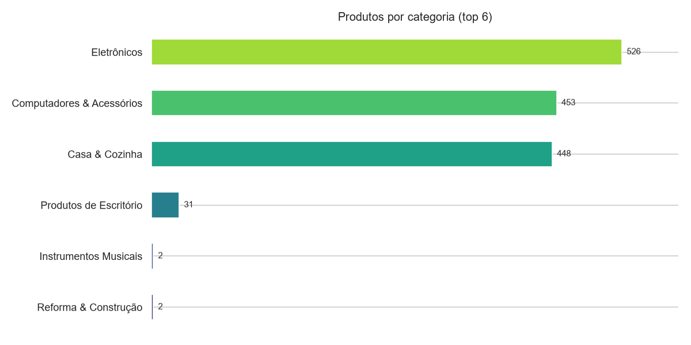
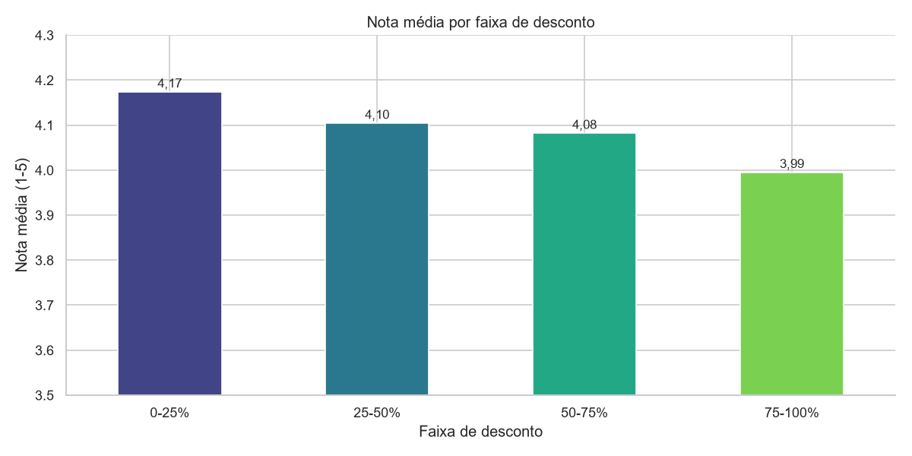
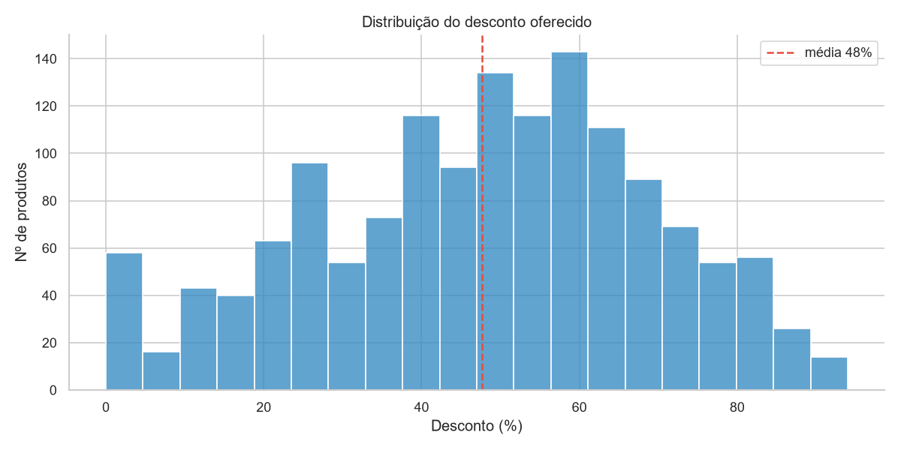

# Análise de Produtos, Preços e Avaliações — Amazon (Índia)

Peguei um dataset público com ~1.500 produtos da Amazon Índia e fui atrás de três perguntas que
qualquer marketplace precisa entender: **onde está concentrado o catálogo**, **o quanto a Amazon
desconta** e se **desconto grande tem a ver com produto melhor avaliado**. Montei o caminho de ponta
a ponta — dos dados brutos na AWS até o dashboard no Power BI — e abaixo está o que encontrei.

> Uma observação honesta sobre os dados: apesar de o dataset ser conhecido como "Amazon Sales", ele
> descreve **produtos** (preço, desconto, nota e nº de avaliações), e **não vendas/faturamento**. Por
> isso a análise gira em torno de preço, desconto e avaliação. Os valores estão em **rupias (₹)**.

**Ferramentas:** AWS (S3 · Glue · Athena) · SQL · Python (pandas) · Power BI

---

## O que eu quis responder

- Quais categorias concentram o catálogo?
- Qual o padrão de desconto da Amazon?
- Desconto maior significa produto melhor avaliado?
- Quais produtos são os mais populares (mais avaliados)?

---

## Os dados

Dataset [Amazon Sales Dataset](https://www.kaggle.com/datasets/karkavelrajaj/amazon-sales-dataset)
do Kaggle: **1.465 produtos**, 16 colunas (categoria, preço original, preço com desconto, % de
desconto, nota, nº de avaliações, texto das reviews, etc.). Os campos vêm como texto — preços com
`₹`, desconto com `%` e vírgulas de milhar — então a primeira etapa foi limpar tudo isso.

---

## Como eu fiz

Fiz questão de passar pelo fluxo completo, do jeito que se faz no trabalho:

1. **AWS S3** — subi o CSV bruto para um bucket, como fonte.
2. **AWS Glue (Crawler + Data Catalog)** — cataloguei o schema automaticamente.
3. **AWS Athena** — explorei com **SQL** direto sobre os dados no S3 (consultas em [`sql/`](sql/)).
4. **Python (pandas)** — limpei os campos (₹, %, vírgulas), calculei as métricas e gerei os gráficos
   (script em [`src/analise_amazon.py`](src/analise_amazon.py) e notebook em [`notebooks/`](notebooks/)).
5. **Power BI** — modelei (esquema floco de neve) e montei o dashboard interativo.


---

## O que eu encontrei

Trabalhando com **1.465 produtos** (nota média **4,10**, desconto médio de **48%** e **26,7 milhões**
de avaliações somadas):

**O catálogo é super concentrado.** Só três categorias — **Eletrônicos** (526 produtos),
**Computadores & Acessórios** (453) e **Casa & Cozinha** (448) — respondem por **~97%** dos produtos.
O resto (Office, Saúde, Instrumentos...) é uma cauda pequena.



**Desconto grande não significa produto melhor — é até o contrário.** Quando separo por faixa de
desconto, a nota média **cai** conforme o desconto sobe: produtos com 0–25% de desconto têm nota
**4,17**, e os com 75–100% caem para **3,99** (correlação de -0,15). Ou seja: promoção agressiva
tende a acompanhar produtos um pouco pior avaliados — algo importante pra não usar "desconto alto"
como sinal de qualidade.



**Descontar é a regra, não a exceção.** A maior parte do catálogo está com desconto entre ~40% e 70%,
e categorias como **Home Improvement** (58%) e **Computadores** (54%) são as que mais descontam.



**Os campeões de popularidade são acessórios baratos de eletrônica.** Os produtos com mais avaliações
são os cabos HDMI da Amazon Basics (~427 mil avaliações), os fones **boAt** e os celulares **Redmi** —
itens de ticket baixo e alto giro.

### O que me chamou atenção

A relação **inversa** entre desconto e nota foi o que mais me surpreendeu — eu imaginava que produto
muito descontado seria "oferta boa", mas os dados sugerem o contrário. E as notas serem tão
espremidas (quase tudo entre 4,0 e 4,4) mostra que **a nota média sozinha diz pouco** nesse catálogo;
o número de avaliações acaba sendo um sinal melhor de relevância.

---

## O dashboard


O arquivo `.pbix` está no repositório — dá pra abrir no Power BI Desktop e interagir.

---

## Um pouco do SQL (AWS Athena)

Nota média por faixa de desconto — a consulta por trás do principal insight:

```sql
WITH base AS (
    SELECT
        TRY_CAST(REPLACE(discount_percentage, '%', '') AS DOUBLE) AS desconto,
        TRY_CAST(rating AS DOUBLE)                                AS nota
    FROM data_set_aws
)
SELECT
    CASE
        WHEN desconto <= 25 THEN '0-25%'
        WHEN desconto <= 50 THEN '25-50%'
        WHEN desconto <= 75 THEN '50-75%'
        ELSE '75-100%'
    END                 AS faixa_desconto,
    ROUND(AVG(nota), 2) AS nota_media,
    COUNT(*)            AS qtd_produtos
FROM base
WHERE nota IS NOT NULL
GROUP BY 1
ORDER BY 1;
```

As demais consultas estão em [`sql/consultas_athena.sql`](sql/consultas_athena.sql).

---

## Limitações e o que eu faria depois

- O dataset **não tem vendas nem datas**, então não dá pra analisar sazonalidade ou receita — a
  análise é de catálogo (preço/desconto/avaliação).
- As notas são pouco discriminantes (viés de sobrevivência); um próximo passo seria **analisar o
  texto das reviews** (NLP) para entender o *porquê* das notas.
- Cruzar preço, desconto e popularidade para estimar **elasticidade** por categoria.

---

## Como rodar

```bash
python -m venv .venv && .venv\Scripts\activate
pip install -r requirements.txt
python src/analise_amazon.py          # limpa os dados e gera os gráficos
# ou abra notebooks/analise_amazon.ipynb
# e o dashboard: abra o .pbix no Power BI Desktop
```

---

Gabriel Leite Rafael da Graça — gabrieleit18@gmail.com
